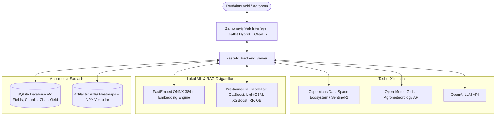

# ZaminTahlil — Aqlli Qishloq Xo‘jaligi Monitoringi va Agro-AI Platformasi

**ZaminTahlil** — O‘zbekiston va Markaziy Osiyo qishloq xo‘jaligi maydonlarini sun’iy yo‘ldosh tasvirlari ($Sentinel-2$ L2A), agrometeorologiya ma’lumotlari ($Open\text{-}Meteo$), Mashinali O‘rganish ($ML$) algoritmlari va $RAG$ (Retrieval-Augmented Generation) agronomik sun’iy intellekti orqali kompleks tahlil qiluvchi innovatsion veb-platformadir.

Ushbu hujjat platformaning me’moriy tuzilishi, funksional imkoniyatlari, matematik-agronomik modellari, ma’lumotlar bazasi arxitekturasi va API spetsifikatsiyasini to‘liq qamrab oladi.

---

## 📑 Mundarija

1. [Strategik Missiya va Loyiha Maqsadi](#1-strategik-missiya-va-loyiha-maqsadi)
2. [Tizim Arxitekturasi va Ma’lumotlar Oqimi](#2-tizim-arxitekturasi-va-malumotlar-oqimi)
3. [Asosiy Funktsional Modullar](#3-asosiy-funktsional-modullar)
   - [3.1. Geofazoviy Xaritalash va Dala Boshqaruvi](#31-geofazoviy-xaritalash-va-dala-boshqaruvi)
   - [3.2. Sentinel-2 L2A Spektral Tahlili va A/B Swipe Viewer](#32-sentinel-2-l2a-spektral-tahlili-va-ab-swipe-viewer)
   - [3.3. Mashinali O‘rganish (ML) Hosildorlik Bashorati](#33-mashinali-organish-ml-hosildorlik-bashorati)
   - [3.4. RAG Agronomiya Bilimlar Bazasi](#34-rag-agronomiya-bilimlar-bazasi)
   - [3.5. Dala Muloqotlari Tarixi va Avtomatik Xulosa (Summary)](#35-dala-muloqotlari-tarixi-va-avtomatik-xulosa-summary)
   - [3.6. Yillik va Tarixiy Indekslar Dinamikasi](#36-yillik-va-tarixiy-indekslar-dinamikasi)
4. [Matematik Formulalar va Hisoblash Metodologiyasi](#4-matematik-formulalar-va-hisoblash-metodologiyasi)
5. [Texnologiyalar Steki](#5-texnologiyalar-steki)
6. [Ma’lumotlar Bazasi Sxemasi (Schema v5)](#6-malumotlar-bazasi-sxemasi-schema-v5)
7. [API Spetsifikatsiyasi (REST Endpoints)](#7-api-spetsifikatsiyasi-rest-endpoints)
8. [Xavfsizlik, Maxfiylik va Ish Rejimlari](#8-xavfsizlik-maxfiylik-va-ish-rejimlari)

---

## 1. Strategik Missiya va Loyiha Maqsadi

An’anaviy dehqonchilikda dalalarni monitoring qilish ko‘p vaqt, jismoniy mehnat va katta xarajat talab qiladi. Sug‘orishdagi nomutanosibliklar, o‘g‘it yetishmasligi, begona o‘tlar yoki vilt kasalliklari ko‘pincha hosil nobud bo‘lgach aniqlanadi.

**ZaminTahlil** ushbu muammolarni quyidagi asosiy yo‘nalishlarda hal etadi:
- **Kosmik monitoring**: Yevropa Kosmik Agentligi ($ESA$) ning $Sentinel-2$ sun’iy yo‘ldoshidan olingan 10 metrlik multispektral tasvirlar orqali dalaning har bir qismini 5 kunda bir marta masofadan turib to‘liq skanerlash;
- **Ob-havo va tuproq integratsiyasi**: $Open\text{-}Meteo$ orqali dalaning aniq geografik nuqtasidagi havo harorati, quyosh radiatsiyasi, bug‘lanish ($ET_0$) va 3 ta chuqurlikdagi (0–7 sm, 7–28 sm, 28–100 sm) tuproq namligini kuzatish;
- **Aniqlik darajasi yuqori hosil bashorati**: 122 ta agrometeorologik va spektral xususiyatlar asosida $CatBoost$, $LightGBM$, $XGBoost$, $RandomForest$ va $GradientBoosting$ algoritmlari yordamida gektariga hosildorlikni ($t/ga$) va jami hosilni ($tonna$) oldindan bashorat qilish;
- **RAG Agronomik AI Maslahatchisi**: Agronomiya kitoblari va darsliklarining mahalliy vektor bazasi ($RAG$) orqali dehqon va agronomlarning har bir savoliga ilmiy asoslangan, kitob sahifasiga havola qilingan aniq amaliy javoblar berish.

---

## 2. Tizim Arxitekturasi va Ma’lumotlar Oqimi

Quyidagi diagramma platformaning asosiy qismlari va ma'lumotlar harakatini ifodalaydi:

---

## 3. Asosiy Funktsional Modullar

### 3.1. Geofazoviy Xaritalash va Dala Boshqaruvi
- **Gibrid Sun’iy Yo‘ldosh Xaritasi**: $Esri\ World\ Imagery$ sun’iy yo‘ldosh qatlami ustiga aholi punktlari, tuman/viloyat chegaralari va yo‘llar tarmog‘i ($World\ Boundaries\ \&\ Places$, $World\ Transportation$) gibrid tarzda qoplangan.
- **Interaktiv Chizish**: $Leaflet\text{-}Draw$ vositasida dala konturi erkin polygon sifatida chiziladi.
- **Geodezik Maydon Hisoblash**: $PyProj$ kutubxonasining WGS84 ellipsoidi ($Geod$) yordamida yer egriligi hisobga olingan holda gektar ($ga$) birligida 100% aniqlikda hisoblanadi.
- **8 Xonali Public ID**: Har bir yangi kiritilgan dalaga ixcham 8 xonali kichik harf va raqamlardan iborat noyob identifikator beriladi (masalan: `r1ntw4h8`, `a7k9b2x4`).
- **Dublikatlardan Himoya**: Dala geometriyasidan olingan SHA-256 xesh kodi orqali ayni bir xil dala qayta kiritilishining oldi olinadi.

### 3.2. Sentinel-2 L2A Spektral Tahlili va A/B Swipe Viewer
- **Haqiqiy Ko‘p Qatlamli Tahlil**: Sentinel Hub orqali oxirgi 5 ta kuzatuv yuklanadi va 10 metrli piksellar katagida quyidagi qatlamlar hisoblanadi:
  1. `RGB`: Tabiiy rangli optik tasvir;
  2. `NDVI`: Normallashtirilgan vegetatsiya indeksi (biomassa zichligi);
  3. `NDMI`: Barg namligi va suv indeksi;
  4. `NDRE`: Qizil chegara xlorofill va azot indeksi;
  5. `EVI`: Rivojlangan vegetatsiya indeksi (atmosfera xatoliklaridan tozalangan);
  6. `BSI`: Ochiq tuproq va sho‘rlanish indeksi;
  7. `QA`: Sifat nazorati (SCL va dataMask bo‘yicha bulut/soya filtri).
- **A/B Swipe Taqqoslash**: Turli sanalardagi yoki turli indekslardagi tasvirlarni slayd (swipe) chizig‘i orqali o‘zaro solishtirish imkoniyati.
- **Aniq Koordinatali Overlay**: Barcha qatlamlar o‘zining haqiqiy geodezik bounding boxi (`artifact.bbox`) bo‘yicha to‘g‘ridan-to‘g‘ri dala xaritasiga joylashtiriladi (`L.imageOverlay`).

### 3.3. 5 Bosqichli Biofizik va Fazoviy Anomaliyalar Diagnostikasi Moduli
Sentinel-2 L2A spektral kanallari asosida daladagi o'choqli muammolarni matematik va biofizik jihatdan aniqlash hamda ularning kelib chiqish sabablarini bir-biridan ajratish:
1. **1-Bosqich: Spektral Piksellarni Qirqish va Filtrlash**:
   - Dala chegarasi polygon maskasi (`data_mask`) yordamida dala tashqarisidagi barcha yo‘llar va ob’yektlar chiqarib tashlanadi.
   - Oxirgi 60 kunlik o‘tishlar ichidan bulutlilik qoplami $\le 30\%$ bo‘lgan eng tiniq va ishonchli piksellar olinadi.
2. **2-Bosqich: 10+ Biofizik Spektral Indekslar Hisoblash**:
   - $NDVI = \frac{B08 - B04}{B08 + B04}$ (Vegetatsiya indeksi)
   - $SAVI = \frac{B08 - B04}{B08 + B04 + 0.5} \times 1.5$ (Tuproq ta'siridan tozalangan vegetatsiya)
   - $LAI = 0.57 \times \exp(2.33 \times NDVI)$ (Barg sathi yuzasi indeksi)
   - $NDRE = \frac{B8A - B05}{B8A + B05}$ (Qizil chegara xlorofill va azot holati)
   - $BRI = \frac{B02}{B04}$ (Bargning erta oqarishi va nekroz ko‘rsatkichi)
   - $LCI = \frac{B8A - B05}{B8A + B04}$ (Barg xlorofill indeksi)
   - $NDWI = \frac{B8A - B11}{B8A + B11}$ (O‘simlik to‘qimalari suv ta’minoti)
   - $MSI = \frac{B11}{B08}$ (Namlik stressi indeksi)
   - $NDSI = \frac{B03 - B11}{B03 + B11}$ (Tuproq va o‘simlik sho‘rlanish darajasi)
   - $\Delta T = (1 - NDWI) \times (1 - NDVI) \times 6.0^\circ\text{C}$ (Transpiratsiya tushishi oqibatidagi barg harorati anomaliyasi)
3. **3-Bosqich: Fazoviy Anomaliyalarni Qidirish va Klasterlash**:
   - Binar anomaliya sharti: $(NDVI < 0.55) \lor (NDVI < \overline{NDVI}_{\text{field}} - 0.10) \lor (NDRE < 0.48) \lor (NDWI < 0.28) \lor (NDSI > 0.38)$.
   - 8-Connectivity fazoviy bog‘lanish (`scipy.ndimage.label`) orqali maydoni $200\text{ m}^2$ (2 piksel) dan katta o‘choqlar klasterlanadi.
   - Maydoni va og‘irligi bo‘yicha eng xavfli **Top 5** ta o‘choq saralanadi va 8 ta kompas sektori (Shimoliy, Janubiy, Sharqiy, G'arbiy, Shimoli-sharqiy va h.k.) hamda koordinata markazi aniqlanadi.
4. **4-Bosqich: 4 Bosqichli Differensial Qarorlar Modeli (Decision Tree)**:
   - **Sho‘rlanish Stressi:** $NDSI \ge 0.38 \land SAVI < 0.30 \to$ Osmotik sho‘r bosimi, fosfogips (3-4 t/ga) va chuqur sho‘r yuvish.
   - **Erta Zamburug‘ Infeksiyasi:** $NDRE < 0.45 \land BRI > 1.20 \land NDWI \ge 0.38 \to$ O‘simlik suvga to‘la bo‘lsa-da xlorofill tez parchalanmoqda (*Verticillium dahliae*, *Puccinia striiformis*, *Phytophthora infestans*). Topsin-M (1.5 kg/ga) yoki Ridomil Gold (2.5 kg/ga) bilan shoshilinch purkash.
   - **Ksilema Blokadasi vs Gidrostress:** $NDWI < 0.25 \land NDRE < 0.40 \to$ Agar oxirgi 60 kunlik dinamikada $NDRE$ oldin tushgan bo‘lsa $\to$ Ildiz/poya tomirlarining zamburug‘li blokadasi; agar $NDWI$ oldin tushgan bo‘lsa $\to$ Sof tuproq namligi tanqisligi (gidrostress).
5. **5-Bosqich: Fazoviy Anizotropiya & Egat Geometriyasi**:
   - Kovariatsiya matritsasi xos qiymatlari $\lambda_{\max}, \lambda_{\min}$ orqali cho‘ziqlik koeffitsiyenti hisoblanadi:
     $$E = \sqrt{\frac{\lambda_{\max}}{\lambda_{\min} + 10^{-4}}}$$
   - $E > 3.0 \to$ Egat bo‘ylab cho‘zilgan chiziqli anomaliya (kultivator, traktor g‘ildiragi zichlashi, o‘g‘it solgich tiqilishi, egat sug‘orish maromi buzilishi);
   - $E \le 3.0 \to$ Markazdan tarqaluvchi konsentrik doirasimon o‘choq (infeksiya tarqalishi, lokal sho‘rxok, mikro-relyef chuqurligi).

### 3.4. Mashinali O‘rganish (ML) Hosildorlik Bashorati
- **Ko‘p manbali 122 ta parametr matritsasi**:
  - $Open\text{-}Meteo$ kunlik agrometeorologiyasi (harorat, namlik, quyosh radiatsiyasi, $ET_0$, 3 chuqurlikdagi tuproq namligi);
  - $Sentinel-2$ optik spektral indekslari ($NDVI, EVI, GNDVI, SAVI, MSAVI, OSAVI, NDRE, NDMI, NDWI$);
  - $Sentinel-1$ SAR radar ko‘rsatkichlari ($VV, VH$, radar nisbati $VV-VH$);
  - Ekin fenologiyasi (ekilganidan beri o‘tgan kunlar, o‘rim-yig‘imgacha qolgan kunlar, mavsumiy rivojlanish fazasi, siklik sinus/kosinus parametrlar).
- **Pre-trained Modellar**:
  - `CatBoost Regressor`
  - `LightGBM Regressor`
  - `XGBoost Regressor`
  - `Random Forest Regressor`
  - `Gradient Boosting Regressor`
- **Natijalar**: 1 Gektar hosildorligi ($t/ga$), ishonchlilik oralig‘i ($\pm \sigma$), butun dalaning jami hosili ($tonna$), eng muhim 10 ta ta’sir omili ($Top\ Features$) hamda 2 o‘qli interaktiv fenologiya grafigi (`Chart.js`) va oylik batafsil jadval.

### 3.5. RAG Agronomiya Bilimlar Bazasi
- **PDF Kitoblarni Parsing Qilish**: Foydalanuvchi istalgan PDF agronomik qo‘llanmani yuklaydi, tizim uni 500–600 belgili mantiqiy bo‘laklarga (overlap: 80–100) ajratadi.
- **100% Mahalliy Vektorlashtirish**: `fastembed` kutubxonasi va `BAAI/bge-small-en-v1.5` ONNX modeli yordamida 384 o‘lchamli binar embeddinglar hisoblanadi (hech qanday pullik tashqi embedding API talab qilinmaydi).
- **Semantik Qidiruv**: Kosinus o‘xshashlik orqali savolga eng mos kitob parchalari ajratib olinadi ($Threshold: 0.50$).
- **Jonli Terminal Monitoringi**: Har bir chat so‘rovida terminalda qidiruv so‘rovi, skanerlangan bo‘laklar soni, topilgan eng yaxshi 3 ta moslik ballari (`score`), kitob nomi va sahifalari rangli tarzda log qilinadi.

### 3.6. Dala Muloqotlari Tarixi va Avtomatik Xulosa (Summary)
- **Doimiy Xotira**: Muloqot xabarlari brauzer keshiga emas, server SQLite bazasiga (`field_chat_messages`) saqlanadi.
- **6 Bosqichli Boyitilgan Prompt**:
  $$\text{System Prompt} + \text{60 kunlik 10+ Metrikalar Taqsimoti} + \text{Fazoviy Anomaliyalar va Qarorlar Shajarasi} + \text{Lo‘nda Summary} + \text{RAG Kitob Faktlari} + \text{Foydalanuvchi Savoli}$$
- **Lo‘nda Xulosa (Summary)**: Har bir muloqotdan so‘ng sun’iy intellekt suhbatning qisqa va faqat eng muhim faktik xulosasini (ekin holati, muammo va berilgan tavsiyalar) yangilab boradi (`field_chat_summaries`).

### 3.7. Yillik va Tarixiy Indekslar Dinamikasi
- $Chart.js$ chiziqli grafigi orqali dalaning yillar bo‘yicha yoki tanlangan sanadan boshlab barcha 5 ta asosiy indekslarining o‘zgarish dinamikasini tahlil qilish.

---

## 4. Matematik Formulalar va Hisoblash Metodologiyasi

### 4.1. Spektral va Biofizik Indekslar Formulalari

| Indeks | To‘liq Nomi | Matematik Formula | Agronomik Ahamiyati |
| :--- | :--- | :--- | :--- |
| **NDVI** | Normalized Difference Vegetation Index | $\frac{B08 - B04}{B08 + B04}$ | Yashil biomassa zichligi va fotosintez faolligi |
| **SAVI** | Soil-Adjusted Vegetation Index | $\frac{B08 - B04}{B08 + B04 + 0.5} \times 1.5$ | Tuproq ochiq joylarida aniq o‘sish ko‘rsatkichi |
| **LAI** | Leaf Area Index | $0.57 \times \exp(2.33 \times NDVI)$ | Barg yuzasi maydoni ($m^2/m^2$) |
| **NDMI** | Normalized Difference Moisture Index | $\frac{B08 - B11}{B08 + B11}$ | O‘simlik barg to‘qimalaridagi suv va namlik |
| **NDRE** | Normalized Difference Red Edge Index | $\frac{B8A - B05}{B8A + B05}$ | Xlorofill miqdori va erta azot yetishmovchiligi |
| **BRI** | Bleaching / Browning Reflectance Index | $\frac{B02}{B04}$ | Barglarning sarg‘ayishi, xloroz va nekroz xavfi |
| **LCI** | Leaf Chlorophyll Index | $\frac{B8A - B05}{B8A + B04}$ | Bargdagi xlorofillning bevosita konsentratsiyasi |
| **NDWI** | Normalized Difference Water Index | $\frac{B8A - B11}{B8A + B11}$ | O‘simlik suv stressi va to‘qima turgori |
| **MSI** | Moisture Stress Index | $\frac{B11}{B08}$ | O‘simlikning qurg‘oqchilikka chidamliligi |
| **NDSI** | Normalized Difference Salinity Index | $\frac{B03 - B11}{B03 + B11}$ | Tuproq va o‘simlikdagi tuz to‘planishi |
| **$\Delta T$** | Canopy Temperature Anomaly | $(1 - NDWI)(1 - NDVI) \times 6.0^\circ\text{C}$ | Transpiratsiya susayishi natijasida qizish |
| **$E$** | Furrow Anisotropy Ratio | $\sqrt{\frac{\lambda_{\max}}{\lambda_{\min} + 10^{-4}}}$ | Egat bo‘yicha chiziqli ($>3.0$) yoki radial doiraviy ($\le 3.0$) o‘choq shakli |
| **EVI** | Enhanced Vegetation Index | $2.5 \times \frac{B08 - B04}{B08 + 6B04 - 7.5B02 + 1}$ | Zich biomassada to‘yinishsiz rivojlanish |
| **BSI** | Bare Soil Index | $\frac{(B11 + B04) - (B08 + B02)}{(B11 + B04) + (B08 + B02)}$ | Ochiq tuproq, mineral holat va sho‘rlanish |

### 4.2. RAG Kosinus O‘xshashlik Formulasi
Ikki vektor $\vec{u}$ (savol) va $\vec{v}$ (kitob bo‘lagi) orasidagi o‘xshashlik:
$$\text{Similarity}(\vec{u}, \vec{v}) = \frac{\vec{u} \cdot \vec{v}}{\|\vec{u}\|_2 \|\vec{v}\|_2}$$

### 4.3. Gidrologik Suv Balansi
$$\text{Water Balance} = \text{Precipitation} - \text{ET}_0$$

---

## 5. Texnologiyalar Steki

| Qatlam | Asosiy Texnologiyalar |
| :--- | :--- |
| **Backend** | Python 3.12+, FastAPI, Uvicorn, Pydantic v2, HTTPX |
| **Ma’lumotlar Bazasi** | SQLite 3 (WAL mode, Foreign Keys ON, Schema v5) |
| **Geofazoviy Tahlil** | Shapely 2.0+, PyProj 3.6+, SciPy 1.18+ (ndimage, linalg), NumPy |
| **Machine Learning** | Scikit-learn, CatBoost, LightGBM, XGBoost, Pandas, Joblib |
| **NLP & RAG** | FastEmbed 768-dim (`nomic-ai/nomic-embed-text-v1.5`), Hybrid Reranker, PyPDF, OpenAI API |
| **Tashqi API-lar** | Copernicus Data Space Ecosystem (Sentinel-2 L2A), Open-Meteo API |
| **Frontend** | Vanilla JavaScript (ES6+), Leaflet, Leaflet-Draw, Chart.js, Marked.js, DOMPurify |
| **Dizayn Tizimi** | Modern Vanilla CSS (Sonar Radar Marker, Glassmorphism, Responsive Grid & Flexbox) |
| **Xavfsizlik & Test** | Pure ASGI Security Headers, Sensitive Data Log Masking, PyTest (61 test) |

---

## 6. Ma’lumotlar Bazasi Sxemasi (Schema v6)

Loyiha quyidagi 10 ta jadvallardan iborat relying bazaga ega:

1. **`fields`**:
   - `id INTEGER PRIMARY KEY AUTOINCREMENT`
   - `public_id TEXT NOT NULL UNIQUE` (8 xonali kichik harf va raqamli ID, masalan: `r1ntw4h8`)
   - `geometry_json TEXT`, `geometry_hash TEXT UNIQUE`, `area_hectares REAL`
   - `crop_name TEXT`, `planted_on TEXT`, `growth_stage TEXT`, `created_at TEXT`, `updated_at TEXT`
2. **`acquisitions`**: Sentinel-2 tasvirlari sanasi (oxirgi 14 kunlik oyna), mahsulot ID, reviziya kaliti, bulutlilik ko‘rsatkichi.
3. **`index_values`**: Har bir tasvir va indeks bo‘yicha hisoblangan `mean_value`, `min_value`, `median_value`, `max_value`.
4. **`artifacts`**: Qatlamlarning PNG render tasvirlari, koordinata bounding boxlari (`bbox_json`), kenglik va balandligi.
5. **`recommendations`**: AI va ekspert agronomik tavsiyalari (Qizil, Sariq, Yashil guruhlar va anomaliya hisoboti).
6. **`field_chat_messages`**: Dala bo‘yicha yozishmalar tarixi (role, content, RAG kitob manbalari, vaqti).
7. **`field_chat_summaries`**: Dala muloqotlarining lo‘nda, qisqa xulosasi (Summary) va xabarlar soni.
8. **`rag_documents`**: Bazaga kiritilgan PDF kitoblar (`is_active`, `embedding_model`, `embedding_dim`, nomi, fayl yo‘li, sahifalar va bo‘laklar soni).
9. **`rag_chunks`**: Kitoblardan ajratilgan matn bo‘laklari va 768 o‘lchamli vektorlar (`embedding BLOB`).
10. **`yield_predictions`**: Hosildorlik bashorati tarixi (model, $t/ga$, jami tonna, top parametrlar, fenologiya).

---

## 7. API Spetsifikatsiyasi (REST Endpoints)

### Dala Boshqaruvi
- `POST /api/fields` — Yangi dala qo‘shish (GeoJSON polygon, ekin nomi, ekilgan sana, rivojlanish bosqichi).
- `GET /api/fields` — Barcha saqlangan dalalar ro‘yxati.
- `GET /api/fields/{id}` — Dala tafsilotlari (id yoki 8 xonali public_id orqali).

### Sun’iy Yo‘ldosh Tahlili & Radar Hotspot
- `POST /api/fields/{id}/analyze` — Oxirgi 14 kunlik Sentinel Hub tasvirlarini yuklash va 10+ indekslarni hisoblash.
- `GET /api/fields/{id}/acquisitions` — Dalaning barcha mavjud kuzatuvlari.
- `GET /api/fields/{id}/acquisitions/{acq_id}/artifacts` — Qatlamlar statistikasi, rasm havolalari va eng past NDRE o'chog'ining `hotspot_coordinates` [lat, lon] qiymati.
- `GET /api/fields/{id}/acquisitions/{acq_id}/images/{layer}` — Qatlamning PNG tasvirini olish (RGB, NDVI, NDMI, NDRE, EVI, BSI, QA).
- `GET /api/fields/{id}/annual-metrics?year=2026` — Yillik indekslar dinamikasi.
- `POST /api/fields/{id}/historical-metrics` — Boshlang‘ich sanadan boshlab tarixiy tasvirlarni yuklash.

### Hosildorlikni Bashorat Qilish (ML)
- `GET /api/yield/models` — Mavjud ML modellari (`CatBoost`, `LightGBM`, `XGBoost`, `RandomForest`, `GradientBoosting`).
- `POST /api/fields/{id}/predict-yield` — 122 ta parametr asosida hosildorlikni hisoblash ($t/ga$, jami tonna, ishonchlilik oralig‘i, top omillar).
- `GET /api/fields/{id}/yield-latest` — Dalaning oxirgi hosildorlik bashorati.

### RAG Bilimlar Bazasi (Ko'p Kitobli Boshqaruv)
- `GET /api/rag/books` — `data/books/` papkasidagi barcha PDF kitoblar holati (`indexed`, `is_active`, `size_mb`).
- `POST /api/rag/books/index-file` — Tanlangan PDF kitobni 768-dim model bilan indekslash.
- `POST /api/rag/books/{id}/toggle` — Kitobni RAG qidiruvi uchun yoqish yoki o'chirish (`is_active`).
- `POST /api/rag/upload` — Yangi PDF kitobni `data/books/` papkasiga yuklash va avtomatik indekslash.
- `POST /api/rag/ingest` — PDF kitobni kiritish va embedding hisoblash.
- `GET /api/rag/documents` — Kiritilgan barcha kitoblar ro‘yxati.
- `DELETE /api/rag/documents/{id}` — Kitobni bazadan o‘chirish.

### Chat & Dala Xulosasi
- `GET /api/fields/{id}/chat/history` — Dala bo‘yicha yozishmalar tarixi.
- `GET /api/fields/{id}/chat/summary` — Dala muloqotlarining umumlashtirilgan xulosasi.
- `POST /api/fields/{id}/chat` — Tanlangan faol kitoblar (`selected_book_ids`), 5 kunlik NDVI va Summary konteksti bilan AI ga savol yuborish.

---

## 8. Xavfsizlik, Maxfiylik va Ish Rejimlari

### 8.1. Ish Rejimlari (`APP_ENV`)
- **`APP_ENV=demo` (Standart)**:
  - Swagger UI (`/docs`), ReDoc (`/redoc`) va OpenAPI spetsifikatsiyasi yoqilgan;
  - To‘liq xatolik izlari (traceback) ko‘rsatiladi;
  - Ishlab chiqish va sinovlar uchun qulay.
- **`APP_ENV=prod` (Ishlab Chiqarish)**:
  - Barcha API hujjatlari yopiq (404);
  - Xatolar umumlashtirilgan holda ko‘rsatiladi (`"Ichki server xatosi"`), tafsilotlar faqat server loglariga yoziladi;
  - Faqat `CORS_ORIGINS` da ruxsat berilgan domenlarga javob beriladi.

### 8.2. Loglarni Avtomatik Maskalash (`SensitiveDataFilter`)
Prod rejimida tizim loglaridagi barcha maxfiy kalitlar (`Bearer ...`, `sk-...`, `client_secret`, parollar va API kalitlar) avtomatik ravishda `***` bilan maskalanadi.

### 8.3. Xavfsizlik Sarlavhalari (`SecurityHeadersMiddleware`)
Har bir HTTP javobga avtomatik tarzda quyidagi xavfsizlik sarlavhalari qo‘shiladi:
- `X-Content-Type-Options: nosniff`
- `X-Frame-Options: DENY`
- `Referrer-Policy: strict-origin-when-cross-origin`
- `Permissions-Policy: camera=(), microphone=(), geolocation=()`
- `Strict-Transport-Security: max-age=31536000; includeSubDomains` (HTTPS so‘rovlar uchun).

### 8.4. 4 Tilda To‘liq Qo‘llab-quvvatlash
Interfeys va AI muloqot tizimi to‘liq 4 ta tilda ishlaydi:
- **O‘zbekcha (lotin)** (`uz-latn`)
- **Ўзбекча (кирилл)** (`uz-cyrl`)
- **Русский** (`ru`)
- **English** (`en`)

